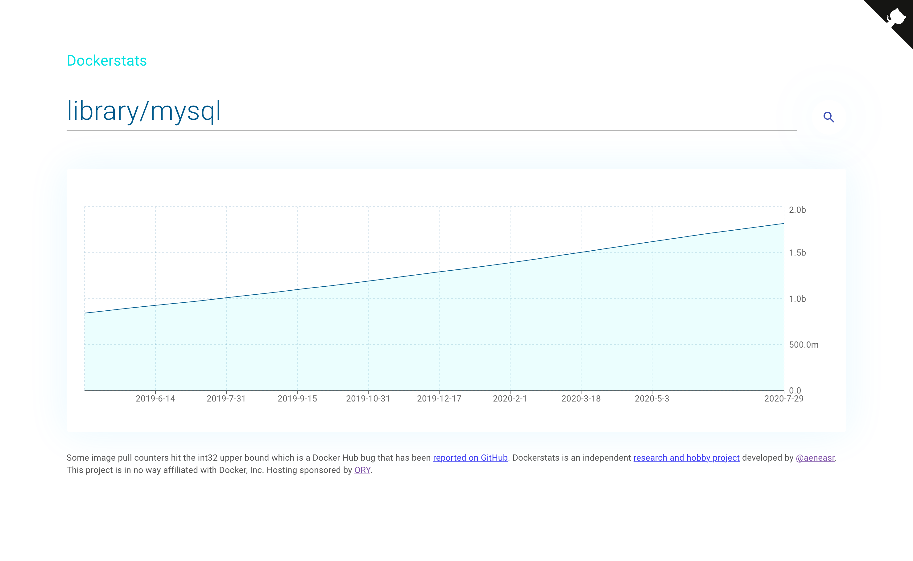

# [dockerstats.com](https://dockerstats.com)

⚠️ Due to recent changes to Docker Hub APIs (rate limits) and new business model, [dockerstats.com](https://dockerstats.com) can no longer collect image statistics at bulk. Due to a lack of time I am also not able to figure out fixes which is why the project will shut down and this repository will be archived. ⚠️

This hobby and research project scraps the Docker Hub API and keeps track of Docker Image Pulls over time. One such example is
[library/nginx](https://dockerstats.com/hubs/docker/library/nginx).

## Limitations

Docker Hub stores image pulls as an int32 which causes several images to report incorrect pull statistics.
An issue has already been filed for this: [hub-feedbak#203](https://github.com/docker/hub-feedback/issues/2003)
